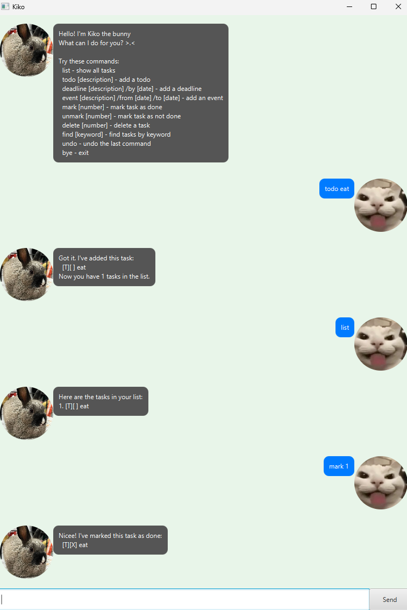

# Kiko User Guide

Kiko is a desktop app for managing tasks, optimized for use via a Command Line Interface (CLI) while still having the benefits of a Graphical User Interface (GUI).

## Quick Start

1.  Ensure you have Java `17` or above installed in your Computer.
2.  Download the latest `kiko.jar` from [here](link-to-releases).
3.  Copy the file to the folder you want to use as the _home folder_ for your Kiko.
4.  Open a command terminal, `cd` into the folder you put the jar file in, and use the `java -jar kiko.jar` command to run the application. 
    A GUI similar to the above should appear in a few seconds.
5.  Type the command in the command box and press Enter to execute it. e.g. typing `help` and pressing Enter will open the help window. 
    Some example commands you can try:

    *   `list` : Lists all tasks.
    *   `todo read book` : Adds a todo task description `read book`.
    *   `deadline return book /by 2024-12-02 1800` : Adds a deadline task with date `2024-12-02 1800`.
    *   `delete 1` : Deletes the 1st task shown in the current list.
    *   `bye` : Exits the app.

6.  Refer to the [Features](#features) below for details of each command.

---

## Features

### Adding a Todo Task: `todo`

Adds a new todo task to the list.

Format: `todo DESCRIPTION`

Example: `todo read book`

### Adding a Deadline Task: `deadline`

Adds a task with a specific deadline.

Format: `deadline DESCRIPTION /by DATE`

*   The date format must be `dd/MM/yyyy HHmm`.

Example: `deadline return book /by 02/12/2024 1800`

### Adding an Event Task: `event`

Adds a task that happens within a specific time period.

Format: `event DESCRIPTION /from START_DATE /to END_DATE`

*   The date format must be `dd/MM/yyyy HHmm`.

Example: `event project meeting /from 02/12/2024 1400 /to 02/12/2024 1600`

### Listing All Tasks: `list`

Shows a list of all tasks in the task list.

Format: `list`

Example: `list`

### Marking a Task as Done: `mark`

Marks a task as completed.

Format: `mark INDEX`

*   The index refers to the index number shown in the displayed task list.

Example: `mark 1`

### Unmarking a Task: `unmark`

Marks a completed task as not done.

Format: `unmark INDEX`

*   The index refers to the index number shown in the displayed task list.

Example: `unmark 1`

### Deleting a Task: `delete`

Deletes the specified task from the list.

Format: `delete INDEX`

*   The index refers to the index number shown in the displayed task list.

Example: `delete 1`

### Finding Tasks: `find`

Finds tasks whose names contain the given keyword.

Format: `find KEYWORD`

Example: `find book`

### Undoing the Previous Command: `undo`

Restores the task list to its state before the last command.

Format: `undo`

Example: `undo`

### Exiting the Program: `bye`

Exits the program.

Format: `bye`

Example: `bye`
